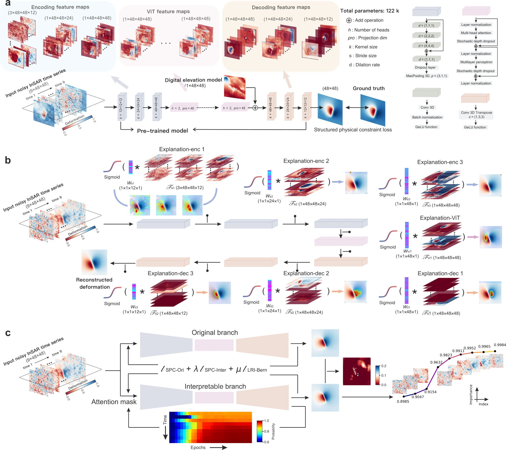
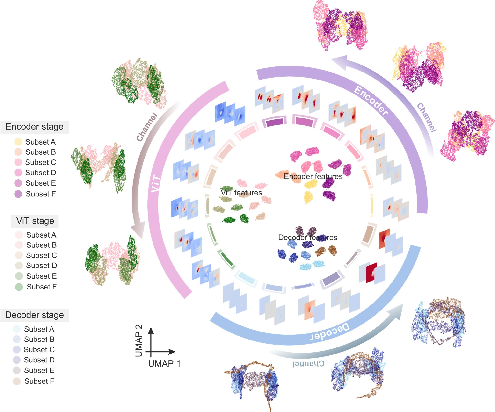
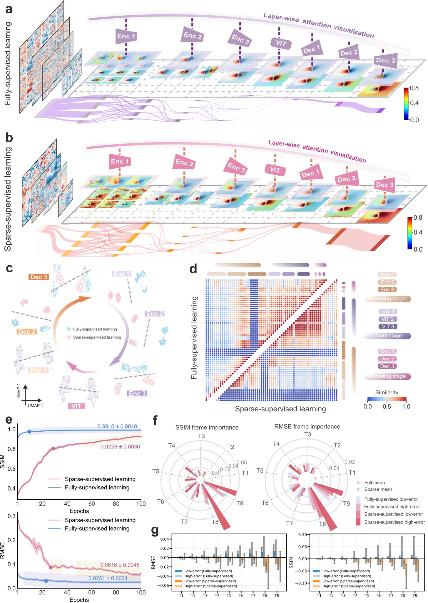

# Interpretable deep learning for InSAR deformation reconstruction

    

## Overview

TransInSAR is designed to achieve atmospheric delay suppression and surface deformation reconstruction in InSAR time series, and is used to analyze the model's feature extraction mechanism at different semantic levels and its structural adaptive behaviour in transferring from synthetic to real data.

## Results

Multi-level visualization of feature representations from the encoder, ViT, and decoder within varying training data proportions in the
InSAR reconstruction model. 

-------------------

Spatial feature response analysis of the deep learning method with fully and sparse supervision.
-------------------   
## License
    GNU General Public License, Version 3
    (http://www.gnu.org/copyleft/gpl.html)  
  
------------------    
## Dependence Packages
* Tensforflow-gpu: 2.10.0
* numpy: 1.23.5
* Keras: 2.10.5
* GPU: GeForce RTX 4090
-------------------   
  
## Contact
    If you have any suggestions or questions, please contact me:
    Liuqing Yang 
    yanglq199301@gmail.com
